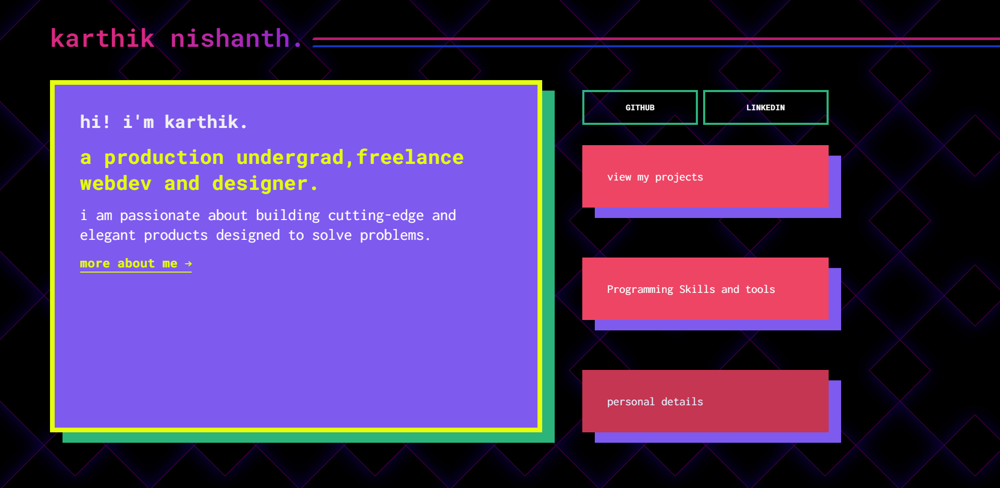

## This is the website for my new portfolio. I had a very simple portfolio in the past and didn't feature much of my work or exactly what I do there.This is a full-blown PWA app based on React .

The design of the app was the main focus The main inspiration for the design came from the "When you hustle, always make it fancy" verse on the STOP TRYING TO BE GOD track, and that's why a lot of the design elements you see on the site are not something you would usually see around the web. I wanted the design of the site to stand out from every other portfolio you see on the internet. This was a tiny side project for me, so I worked on it over the months. And the end product is a design that's equally weird and unique.
